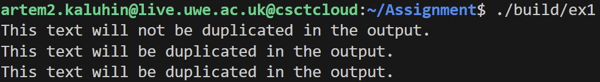
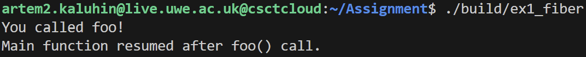
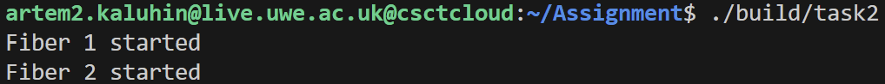
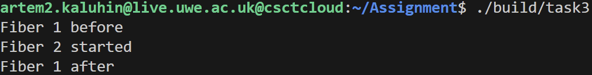
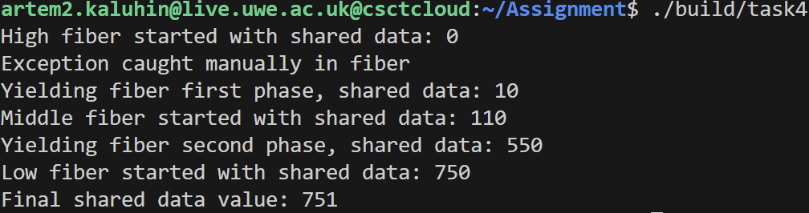
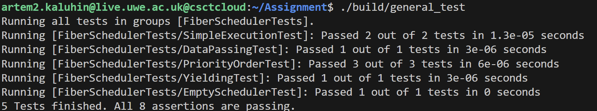

# Advanced Systems Programming

## Fiber Scheduler Assignment

### Table of Contents
- [Introduction](#introduction)
- [Tasks overview](#tasks-overview)
- [Installation](#installation)
- [Tasks](#tasks)
    - [Task 1](#task1-context-switching-and-custom-stack)
    - [Task 2](#task2-fiber-and-scheduler-classes)
    - [Task 3](#task3-cooperative-yielding)
    - [Additional work](#additional-work)
- [Tests](#tests)
- [Task Build](#task-build)

### Introduction
Fiber Scheduler - is a simple runtime for cooperative tasks(fibers) in C++, which allows to create and schedule function completing with separate stacks, priorities, ability to stop(yeild) and also provides data sharing between fibers with exception processing.

### Tasks Overview
 - Task 1: Implement basic context saving and restoring, with using `get_context`, `set_context` and demonstrate switching between contexts.
 - Task 2: Build Fiber and Scheduler classes, implement a Scheduler with FIFO queues and methods such as `spawn`, `do_it` and `fiber_exit`.
 - Task 3: Add `yeild` method that allows to pause `Fiber` completing and return contorl to the `Scheduler`

### Project includes
This project is being completed with main components
- Fiber - a class that encapsulates a separate tasks and execute context for a single cooperative task
- Scheduler - controlling `Fiber`'s queue by priorities and providing context switching.
- Tests - set of unit examples and tests for checking correctness of working all components
- Context submodule - assembler library for saving and restoring CPU-registers and stack.
- Simpletest submodule - lightweight framework for doing and completing unit-tests

The following submodules can be found there:
- `context`: [Context repository link](https://gitlab.uwe.ac.uk/br-gaster/context)
- `simpletest`[Simpletest repository link](https://github.com/kudaba/simpletest_test)


### Installation
To install and run this code locally:
```bash
git clone --recurse-submodules https://github.com/KaluginArtem/Advanced-Systems-Programming-Assignment.git
cd Advanced-Systems-Programming-Assignment
```

### Tasks

#### Task1: Context switching and Custom Stack
- Study and use `context` library from `context submodule` for saving and restoring CPU-registers(RIP, RSP and saved registers SysV ABI) with using `get_context` and `set_context`.
- Allocate a manual stack(e.g. 4096 bytes), align to the stack pointer to 16 bytes, account the 128-byte "Red Zone", and set up `context` to run the fiber function(`foo`), which demonstrates switching between stacks.

**Implementation**
```cpp
volatile int global_var = 0;

int main() {
    Context c;

    printf("This text will not be duplicated in the output.\n");
    
    get_context(&c);

    printf("This text will be duplicated in the output.\n");

    if(global_var == 0) {
        global_var += 1;
        set_context(&c);
    }
    return 0;
}
```
**Output**


**Implementation**
```cpp
void foo() {
    printf("You called foo!\n");

    swap_context(&c, &main_context);
}

int main() {
    const size_t stack_size = 4096; // 4 KiB
    char *stack = new char[stack_size];

    void* sp = stack + stack_size; // Stack grows downwards

    uintptr_t sp_val = reinterpret_cast<uintptr_t>(sp);
    sp_val &= ~static_cast<uintptr_t>(0xF); // Align to 16 bytes
    sp = reinterpret_cast<void*>(sp_val);

    sp = static_cast<char*>(sp) - 128; // Reserve space for local variables

    c.rip = reinterpret_cast<void*>(foo);
    c.rsp = sp;

    swap_context(&main_context, &c);

    printf("Main function resumed after foo() call.\n");
    delete[] stack;
    return 0;
}
```
**Output**


#### Task2: Fiber and Scheduler Classes
- **Fiber**
    - allocate it's own stack(4096 B), align to 16 bytes and takes into account the 128 bytes of the "Red Zone"
    - set up `Context` (RIP, RSP and saving ragisters) to start shared function
- **Scheduler**
    - implement multichannel queue `std::deque<Fiber*>`
    - Methods:
        - `spawn(Fiber*)` - add fiber to queue
        - `do_it()` - run and wait until it finish
        - `fiber_exit()` - finish current fiber

**Implementation**
**Fiber**
```cpp
class Fiber {
public:

    Fiber(void (*function)(), std::size_t stack_size = 4096);

    ~Fiber();
    
    Context* getContext();

private:
    Context _context;
    char* _stack_bottom;
    char* _stack_top;
};
```

**Scheduler**
```cpp
class Scheduler {
public:
    Scheduler() = default;
    ~Scheduler() = default;

    void spawn(Fiber* f);
    void do_it();
    void fiber_exit();
    
private:
    std::deque<Fiber*> _fibers;
    Context _context;
    Fiber* _current_fiber;
};
```
**Output**



#### Task3 Cooperative Yielding
Extend `Scheduler` with `yield()` method:
- storing context of current fiber in `yield()`
- put it in the queue
- switch to the `Scheduler` context
- on the next run continue after `yield()`

**Implementation**
```cpp
void Scheduler::yeild() {
    assert(_current_fiber);
    Fiber* f = _current_fiber;
    _fibers.push_back(f);
    _current_fiber = nullptr;
    swap_context(f->getContext(), &_context);
    _current_fiber = f;
}
```
**Output**


#### Additional work
Beyond the core tasks, several enhancements were implemented to improve functionality, performance, and robustness of the fiber scheduler:

- **Priority-based task scheduling**
Tasks are executed based on their assigned priority using a multi-level queue system. Higher priority tasks execute first before low-priority ones which gives more predictable execution order.
**Applied changes**
```cpp
class Fiber {
public:
    Fiber(void (*function)(), int priority = 0, std::size_t stack_size = 4096);
    ~Fiber();

    Context* getContext();

    int getPriority() const;
    void setPriority(int priority);

private:
    Context _context;
    char* _stack_bottom;
    char* _stack_top;    
    int _priority; 
};
```
- **Data sharing between Fibers**
Each `Fiber` instance support user-defined data via `get_data()` and `set_data()` enabling inter-fiber communication and shared state management.
**Applied changes**
```cpp
class Fiber {
public:
    Fiber(void (*function)(), int priority = 0, std::size_t stack_size = 4096, void* data = nullptr);
    ~Fiber();

    Context* getContext();

    int getPriority() const;
    void setPriority(int priority);

    void* getData() const;
    void setData(void* data);
private:
    Context _context;
    char* _stack_bottom;
    char* _stack_top;   
    int _priority;
    void* _data;
};
```
- **Error and execution handling**
Exception thrown within fibers are safely caught and delegated to a user-defined error handler via `onError(...)`, which prevents programm crashes. 
**Applied changes**
```cpp
class Scheduler {
public:
    Scheduler() = default;
    ~Scheduler() = default;

    void spawn(Fiber* f);
    void yield();
    void do_it();
    void fiberExit();
    void setPriority(Fiber* f, int priority);
    Fiber* current() const;

    void onError( std::function<void(Fiber*, std::exception_ptr)> handler);
private:
    std::map<int, std::deque<Fiber*>, std::greater<int>> _fibers; 
    Context _context;
    Fiber* _current_fiber = nullptr;
    std::function<void(Fiber*, std::exception_ptr)> _error_handler;
};
```

**Output**


### Tests
For a more accurate check of the correctness of the work tests were described that check the accuracy of the work in different situations
Such as:
- **SimpleExecutionTest** - check that tasks(fibers) running and finishing correct
- **DataPassingTest** - check data sharing and changing main data between fibers
- **PriorityOrderTest** - checks the execution of fibers in descending order of priority
- **YieldingTest** - demonstrate that yield() pauses and correctly resumes fibers completing
- **EmptySchedulerTest** - checks that scheduler do not fall with running without tasks

**Output**


### Task Build 
To compile and and build the tasks run the following commands:
Task 1:
```bash
g++ -std=c++17 src/task1/ex1.cpp context/context.s -o build/ex1
./build/ex1
```
Task 1 Fiber:
```bash
g++ -std=c++17 -I./context src/task1/ex1_fiber.cpp context/context.s -o build/ex1_fiber
./build/ex1_fiber
```
Task 2:
```bash
g++ -std=c++17 -I./context src/task2/test.cpp src/task2/fiber/fiber.cpp src/task2/scheduler/scheduler.cpp context/context.s -o build/task2
./build/task2
```
Task 3:
```bash
g++ -std=c++17 -I./context src/task3/test.cpp src/task3/fiber/fiber.cpp src/task3/scheduler/scheduler.cpp context/context.s -o build/task3
./build/task3
```
Additional work
```bash
g++ -std=c++17 -I./context src/task4_additional_work/test.cpp src/task4_additional_work/fiber/fiber.cpp src/task4_additional_work/scheduler/scheduler.cpp context/context.s -o build/task4
./build/task4
```

These scripts will compile and run the programs to show basic test and it's functionality